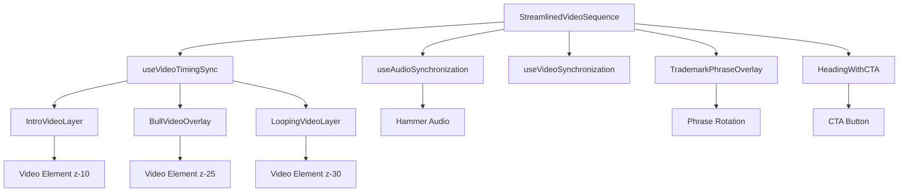
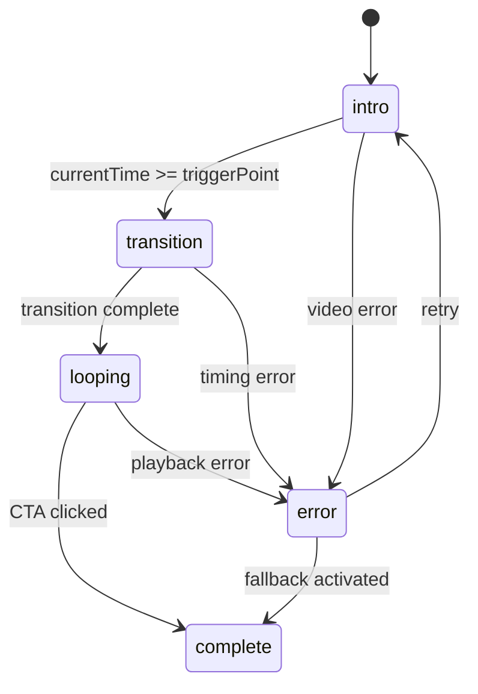

# Bull Video Overlay Technical Specification

## Overview
Design a streamlined video sequence application that implements a bull video overlay starting 1 second before the intro video concludes, creating a seamless transition with synchronized audio. The design simplifies the existing architecture by removing non-essential components while maintaining core functionality.

## 1. Component Architecture Design

### 1.1 Simplified VideoSequence Component Structure

```typescript
interface StreamlinedVideoSequenceProps {
  introVideoUrl: string;
  bullVideoUrl: string; // https://res.cloudinary.com/djg0pqts6/video/upload/v1763117114/1103_2_yfa7mp.mp4
  hammerAudioUrl: string; // /public/hammer.mp3
  onSequenceComplete: () => void;
}
```

### 1.2 Component Hierarchy

```
StreamlinedVideoSequence (z-index container)
├── IntroVideoLayer (z-10)
├── BullVideoOverlay (z-25) - NEW COMPONENT
├── LoopingVideoLayer (z-30)
├── TrademarkPhraseOverlay (z-40)
└── HeadingWithCTA (z-50)
```

### 1.3 New BullVideoOverlay Component

```typescript
interface BullVideoOverlayProps {
  videoUrl: string;
  isVisible: boolean;
  opacity: number;
  onVideoReady: () => void;
  onVideoError: (error: Error) => void;
}

export const BullVideoOverlay: React.FC<BullVideoOverlayProps> = ({
  videoUrl,
  isVisible,
  opacity,
  onVideoReady,
  onVideoError
}) => {
  // Minimal video element with GPU acceleration
  // No loading states, no play buttons, no complex error handling
  // Direct video element with essential attributes only
};
```

### 1.4 Z-Index Layering Strategy

| Layer | Component | Z-Index | Visibility Timing |
|-------|-----------|---------|-------------------|
| 1 | IntroVideoLayer | 10 | 0s → (duration - 1s) |
| 2 | BullVideoOverlay | 25 | (duration - 1s) → transition complete |
| 3 | LoopingVideoLayer | 30 | transition complete → infinite |
| 4 | TrademarkPhraseOverlay | 40 | bull video start → infinite |
| 5 | HeadingWithCTA | 50 | bull video start + 2s → infinite |

### 1.5 State Management Design

```typescript
interface StreamlinedSequenceState {
  phase: 'intro' | 'transition' | 'looping' | 'complete';
  introOpacity: number;
  bullOpacity: number;
  loopingOpacity: number;
  showPhrases: boolean;
  showHeadingCTA: boolean;
  audioPlayed: boolean;
}
```

## 2. Timing Synchronization Strategy

### 2.1 Precise Timing Mechanism

```typescript
const useVideoTimingSync = () => {
  const [introDuration, setIntroDuration] = useState<number>(0);
  const [currentTime, setCurrentTime] = useState<number>(0);
  const [triggerPoint, setTriggerPoint] = useState<number>(0);
  
  // Calculate trigger point: introDuration - 1000ms
  useEffect(() => {
    if (introDuration > 0) {
      const point = Math.max(0, introDuration - 1000);
      setTriggerPoint(point);
    }
  }, [introDuration]);
  
  // Monitor intro video currentTime
  const handleTimeUpdate = useCallback((time: number) => {
    setCurrentTime(time);
    
    // Trigger bull overlay 1 second before intro ends
    if (time >= triggerPoint && triggerPoint > 0) {
      startBullOverlay();
    }
  }, [triggerPoint]);
};
```

### 2.2 Fallback Timing Mechanism

```typescript
const useFallbackTiming = () => {
  // When video duration is unavailable, use predefined timing
  const FALLBACK_INTRO_DURATION = 8000; // 8 seconds fallback
  const FALLBACK_TRIGGER_POINT = FALLBACK_INTRO_DURATION - 1000; // 7 seconds
  
  useEffect(() => {
    if (introDuration === 0) {
      const fallbackTimer = setTimeout(() => {
        startBullOverlay();
      }, FALLBACK_TRIGGER_POINT);
      
      return () => clearTimeout(fallbackTimer);
    }
  }, [introDuration]);
};
```

### 2.3 Transition Coordination

```typescript
const transitionSequence = {
  'intro': {
    duration: 'variable',
    actions: ['play intro video', 'monitor currentTime', 'preload bull video']
  },
  'transition': {
    duration: '1000ms',
    actions: [
      'start bull video overlay',
      'fade in bull video (opacity 0→1)',
      'play hammer audio',
      'start trademark phrases'
    ]
  },
  'looping': {
    duration: 'infinite',
    actions: [
      'fade out intro video',
      'fade in looping video',
      'show heading and CTA after 2s'
    ]
  }
};
```

## 3. Audio Synchronization Design

### 3.1 useAudioSynchronization Hook

```typescript
interface AudioState {
  isLoaded: boolean;
  isPlaying: boolean;
  hasError: boolean;
  volume: number;
}

const useAudioSynchronization = (audioUrl: string) => {
  const [audioState, setAudioState] = useState<AudioState>({
    isLoaded: false,
    isPlaying: false,
    hasError: false,
    volume: 0.8
  });
  
  const audioRef = useRef<HTMLAudioElement | null>(null);
  
  // Preload audio alongside video preloading
  const preloadAudio = useCallback(async () => {
    const audio = new Audio();
    audio.src = audioUrl;
    audio.preload = 'auto';
    audio.volume = 0.8;
    
    audio.addEventListener('canplaythrough', () => {
      setAudioState(prev => ({ ...prev, isLoaded: true }));
    });
    
    audio.addEventListener('error', () => {
      setAudioState(prev => ({ ...prev, hasError: true }));
    });
    
    audioRef.current = audio;
    await audio.load();
  }, [audioUrl]);
  
  // Play audio synchronized with bull video appearance
  const playAudio = useCallback(async () => {
    if (audioRef.current && audioState.isLoaded) {
      try {
        await audioRef.current.play();
        setAudioState(prev => ({ ...prev, isPlaying: true }));
      } catch (error) {
        console.warn('Audio autoplay blocked:', error);
        // Handle browser autoplay compliance
      }
    }
  }, [audioState.isLoaded]);
  
  return { audioState, preloadAudio, playAudio };
};
```

### 3.2 Audio Preloading Strategy

```typescript
const useIntegratedPreloading = (videoUrls: string[], audioUrl: string) => {
  const preloadAllAssets = useCallback(async () => {
    // Start video and audio preloading simultaneously
    const videoPromises = videoUrls.map(url => preloadVideo(url));
    const audioPromise = preloadAudio(audioUrl);
    
    // Wait for all assets to be ready
    await Promise.allSettled([...videoPromises, audioPromise]);
  }, [videoUrls, audioUrl]);
  
  return { preloadAllAssets };
};
```

### 3.3 Browser Autoplay Compliance

```typescript
const handleAutoplayCompliance = async () => {
  // Create user interaction event listener for audio
  const enableAudio = () => {
    if (audioRef.current) {
      audioRef.current.play().then(() => {
        // Audio successfully started with user interaction
      }).catch(error => {
        console.warn('Audio still blocked after user interaction:', error);
      });
    }
    document.removeEventListener('click', enableAudio);
    document.removeEventListener('touchstart', enableAudio);
  };
  
  // Add event listeners for user interaction
  document.addEventListener('click', enableAudio, { once: true });
  document.addEventListener('touchstart', enableAudio, { once: true });
};
```

## 4. Video Preloading Integration

### 4.1 Enhanced useVideoSynchronization Hook

```typescript
const useStreamlinedVideoSynchronization = (videoUrls: string[]) => {
  const [videoStates, setVideoStates] = useState<Record<string, VideoState>>({});
  
  // Include bull video in preloading
  const preloadAllVideos = useCallback(async () => {
    const preloadPromises = videoUrls.map(url => {
      return new Promise<void>((resolve, reject) => {
        const video = document.createElement('video');
        video.preload = 'auto';
        video.muted = true;
        video.playsInline = true;
        video.loop = url === videoUrls[2]; // Loop only the third video (looping video)
        video.crossOrigin = 'anonymous';
        
        video.addEventListener('canplaythrough', () => {
          setVideoStates(prev => ({
            ...prev,
            [url]: { ...prev[url], canPlay: true, isLoaded: true }
          }));
          resolve();
        });
        
        video.addEventListener('error', () => {
          reject(new Error(`Failed to preload video: ${url}`));
        });
        
        video.src = url;
        video.load();
      });
    });
    
    await Promise.allSettled(preloadPromises);
  }, [videoUrls]);
  
  return { videoStates, preloadAllVideos };
};
```

### 4.2 Bull Video State Tracking

```typescript
interface BullVideoState extends VideoState {
  overlayActive: boolean;
  syncWithIntro: boolean;
  transitionInProgress: boolean;
}

const useBullVideoState = () => {
  const [bullState, setBullState] = useState<BullVideoState>({
    url: '',
    isLoading: false,
    isLoaded: false,
    canPlay: false,
    error: null,
    element: null,
    bufferedPercent: 0,
    overlayActive: false,
    syncWithIntro: false,
    transitionInProgress: false
  });
  
  const activateOverlay = useCallback(() => {
    setBullState(prev => ({
      ...prev,
      overlayActive: true,
      syncWithIntro: true
    }));
  }, []);
  
  return { bullState, activateOverlay };
};
```

### 4.3 Cleanup Strategy

```typescript
const useVideoCleanup = (videoElements: Record<string, HTMLVideoElement>) => {
  const cleanup = useCallback(() => {
    Object.entries(videoElements).forEach(([url, video]) => {
      if (video) {
        video.pause();
        video.src = '';
        video.load();
        video.remove();
      }
    });
    
    // Clear references
    Object.keys(videoElements).forEach(url => {
      delete videoElements[url];
    });
  }, [videoElements]);
  
  useEffect(() => {
    return cleanup;
  }, [cleanup]);
};
```

## 5. Performance Optimization Strategy

### 5.1 GPU Acceleration Approaches

```typescript
const useGPUAcceleration = () => {
  const gpuAcceleratedStyles = {
    // Force GPU layer creation
    transform: 'translateZ(0)',
    willChange: 'opacity, transform',
    // Optimize for smooth transitions
    backfaceVisibility: 'hidden' as const,
    perspective: 1000,
    // Enable hardware acceleration
    translateZ: 0,
    scale3d: 1
  };
  
  return { gpuAcceleratedStyles };
};
```

### 5.2 Memory Management

```typescript
const useMemoryManagement = () => {
  const cleanupVideoMemory = useCallback((videoElement: HTMLVideoElement) => {
    // Clear video buffer to free memory
    videoElement.pause();
    videoElement.currentTime = 0;
    videoElement.src = '';
    videoElement.load();
    
    // Remove from DOM if detached
    if (videoElement.parentNode) {
      videoElement.parentNode.removeChild(videoElement);
    }
  }, []);
  
  const optimizeMemoryUsage = useCallback(() => {
    // Force garbage collection hints
    if (window.gc) {
      window.gc();
    }
    
    // Clear unused event listeners
    // Clear timers and intervals
  }, []);
  
  return { cleanupVideoMemory, optimizeMemoryUsage };
};
```

### 5.3 Minimizing Re-renders

```typescript
const useOptimizedTransitions = () => {
  const transitionRef = useRef<{
    introOpacity: number;
    bullOpacity: number;
    loopingOpacity: number;
  }>({
    introOpacity: 1,
    bullOpacity: 0,
    loopingOpacity: 0
  });
  
  // Batch opacity updates to minimize re-renders
  const batchOpacityUpdate = useCallback((updates: Partial<typeof transitionRef.current>) => {
    Object.assign(transitionRef.current, updates);
    
    // Trigger single re-render with requestAnimationFrame
    requestAnimationFrame(() => {
      setSequenceState(prev => ({
        ...prev,
        ...transitionRef.current
      }));
    });
  }, []);
  
  return { batchOpacityUpdate };
};
```

## 6. Error Handling and Fallbacks

### 6.1 Graceful Degradation Strategy

```typescript
const useErrorHandling = () => {
  const [errorState, setErrorState] = useState<{
    hasError: boolean;
    errorType: 'video' | 'audio' | 'timing' | 'unknown';
    fallbackActivated: boolean;
  }>({
    hasError: false,
    errorType: 'unknown',
    fallbackActivated: false
  });
  
  const handleVideoError = useCallback((error: Error) => {
    console.error('Video error:', error);
    setErrorState({
      hasError: true,
      errorType: 'video',
      fallbackActivated: true
    });
    
    // Fallback to static image or next video
    activateFallbackSequence();
  }, []);
  
  const handleTimingError = useCallback(() => {
    console.warn('Timing synchronization failed, using fallback');
    setErrorState({
      hasError: true,
      errorType: 'timing',
      fallbackActivated: true
    });
    
    // Use predefined timing values
    activateFallbackTiming();
  }, []);
  
  return { errorState, handleVideoError, handleTimingError };
};
```

### 6.2 Fallback Behaviors

```typescript
const fallbackStrategies = {
  videoLoadFailure: {
    // Skip to next video in sequence
    action: 'skipToNextVideo',
    timing: 'immediate'
  },
  timingSyncFailure: {
    // Use predefined timing values
    action: 'useFallbackTiming',
    timing: 'predefined'
  },
  audioPlaybackFailure: {
    // Continue without audio
    action: 'continueWithoutAudio',
    timing: 'unchanged'
  },
  completeFailure: {
    // Show static image with CTA
    action: 'showStaticFallback',
    timing: 'immediate'
  }
};
```

### 6.3 User Experience Considerations

```typescript
const useUserExperienceFallbacks = () => {
  const ensureContentVisibility = useCallback(() => {
    // Always ensure CTA button is visible
    const showCTAFallback = setTimeout(() => {
      setShowHeadingCTA(true);
    }, 5000); // Show CTA after 5 seconds regardless of video state
    
    return () => clearTimeout(showCTAFallback);
  }, []);
  
  const maintainPhraseRotation = useCallback(() => {
    // Continue phrase rotation even if videos fail
    if (videoError) {
      startPhraseRotationWithBackground();
    }
  }, [videoError]);
  
  return { ensureContentVisibility, maintainPhraseRotation };
};
```

## 7. Implementation Roadmap

### Phase 1: Core Architecture (Week 1)
1. Create streamlined VideoSequence component
2. Implement BullVideoOverlay component
3. Design state management system
4. Set up z-index layering

### Phase 2: Timing & Synchronization (Week 1-2)
1. Implement useVideoTimingSync hook
2. Create fallback timing mechanisms
3. Design transition coordination
4. Test timing precision

### Phase 3: Audio Integration (Week 2)
1. Implement useAudioSynchronization hook
2. Create audio preloading strategy
3. Handle browser autoplay compliance
4. Test audio-video synchronization

### Phase 4: Performance & Optimization (Week 2-3)
1. Implement GPU acceleration
2. Optimize memory management
3. Minimize re-renders
4. Performance testing

### Phase 5: Error Handling & Testing (Week 3)
1. Implement error handling strategies
2. Create fallback mechanisms
3. Cross-browser testing
4. User experience testing

## 8. Component Diagrams

### 8.1 Component Flow Diagram



### 8.2 State Management Flow



### 8.3 Timing Sequence Diagram

```mermaid
gantt
    title Video Sequence Timing
    dateFormat X
    axisFormat %s
    
    section Intro Video
    Intro Video     :0, 7s
    Intro Fade Out  :6s, 1s
    
    section Bull Video
    Bull Preload    :0, 2s
    Bull Start      :6s, 1s
    Bull Fade In    :6s, 1s
    Bull Fade Out   :7s, 1s
    
    section Looping Video
    Looping Preload :0, 3s
    Looping Start   :7s, 1s
    Looping Fade In :7s, 1s
    
    section Audio
    Audio Preload   :0, 1s
    Hammer Sound    :6s, 0.5s
    
    section UI Elements
    Phrases Start   :6s, 2s
    Heading Start   :8s, 1s
    CTA Start       :8s, 1s
```

## 9. Integration Points with Existing Code

### 9.1 App.tsx Integration

```typescript
// Simplified App.tsx
function App() {
  const [showVideoSequence, setShowVideoSequence] = useState(true);

  const handleSequenceComplete = () => {
    setShowVideoSequence(false);
  };

  return (
    <div className="App relative">
      {showVideoSequence ? (
        <StreamlinedVideoSequence
          introVideoUrl="https://res.cloudinary.com/djg0pqts6/video/upload/v1763329342/1114_2_z4csev.mp4"
          bullVideoUrl="https://res.cloudinary.com/djg0pqts6/video/upload/v1763117114/1103_2_yfa7mp.mp4"
          hammerAudioUrl="/hammer.mp3"
          onSequenceComplete={handleSequenceComplete}
        />
      ) : (
        <div className="min-h-screen flex items-center justify-center bg-black">
          <h1 className="text-white text-4xl">ARCHE FORGE</h1>
        </div>
      )}
    </div>
  );
}
```

### 9.2 Reusable Components

- Keep `TrademarkPhraseOverlay` component (no changes needed)
- Keep `HeadingWithCTA` component (no changes needed)
- Remove `LoadingOverlay` component
- Remove `AnimatedHero` component
- Remove `useTransitionTiming` hook
- Simplify `useVideoSynchronization` hook

### 9.3 File Structure

```
src/
├── components/
│   └── ui/
│       ├── streamlined-video-sequence.tsx (NEW)
│       ├── bull-video-overlay.tsx (NEW)
│       ├── trademark-phrase-overlay.tsx (EXISTING)
│       └── heading-with-cta.tsx (EXISTING)
├── hooks/
│   ├── use-video-timing-sync.ts (NEW)
│   ├── use-audio-synchronization.ts (NEW)
│   └── use-video-synchronization.ts (SIMPLIFIED)
├── data/
│   └── trademark-phrases.ts (EXISTING)
└── App.tsx (SIMPLIFIED)
```

## 10. Technical Specifications

### 10.1 Video Specifications

| Property | Intro Video | Bull Video | Looping Video |
|----------|-------------|------------|---------------|
| URL | Cloudinary intro | Cloudinary bull | Same as bull |
| Duration | Variable | Variable | Infinite loop |
| Z-Index | 10 | 25 | 30 |
| Autoplay | Yes | Yes | Yes |
| Muted | Yes | Yes | Yes |
| Loop | No | No | Yes |

### 10.2 Audio Specifications

| Property | Hammer Audio |
|----------|--------------|
| File | /public/hammer.mp3 |
| Format | MP3 |
| Volume | 0.8 |
| Trigger | Bull video start |
| Duration | Variable |
| Loop | No |

### 10.3 Timing Specifications

| Event | Timing | Trigger |
|-------|--------|---------|
| Intro video start | 0s | Component mount |
| Bull video preload | 0s | Component mount |
| Bull video start | introDuration - 1s | Intro currentTime |
| Hammer audio play | introDuration - 1s | Bull video start |
| Phrase rotation start | introDuration - 1s | Bull video start |
| Intro fade out | introDuration - 1s | Bull video start |
| Looping video start | introDuration | Bull video start |
| Heading/CTA fade in | introDuration + 1s | Looping video start |

This technical specification provides a comprehensive blueprint for implementing the simplified bull video overlay with synchronized audio, focusing on performance, reliability, and user experience.