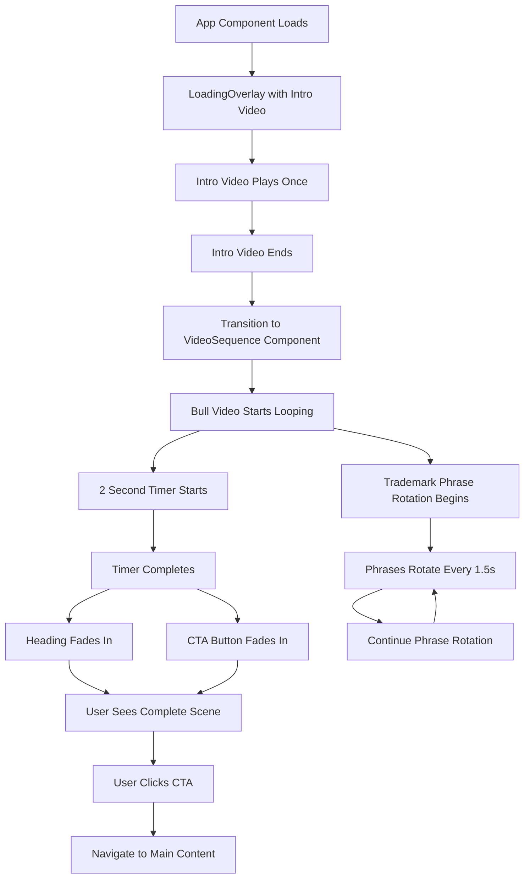
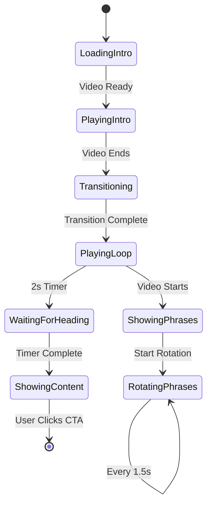

# Video Sequence Flow Diagram



## Component Hierarchy

```
App
├── LoadingOverlay (Intro Video)
└── VideoSequence
    ├── LoopingVideo (Bull Video)
    ├── TrademarkPhraseOverlay
    └── HeadingWithCTA
        ├── Heading
        └── CTA Button
```

## State Management Flow



## Timing Sequence

```
Time (s) | Component          | Action
---------|-------------------|-----------------------------------------
0.0      | LoadingOverlay     | Intro video starts playing
?        | LoadingOverlay     | Intro video ends (varies by video length)
0.0      | VideoSequence      | Bull video starts looping
0.0      | PhraseOverlay      | First phrase appears
1.5      | PhraseOverlay      | Second phrase (fade transition)
3.0      | PhraseOverlay      | Third phrase (fade transition)
...      | PhraseOverlay      | Continue rotating every 1.5s
2.0      | HeadingWithCTA     | Heading and CTA fade in together
```

## Responsive Breakpoints

```mermaid
graph LR
    A[Mobile < 768px] --> B[Phrase: 16px]
    A --> C[Heading: 24px]
    A --> D[CTA: 14px]
    
    E[Tablet 768-1024px] --> F[Phrase: 18px]
    E --> G[Heading: 32px]
    E --> H[CTA: 16px]
    
    I[Desktop > 1024px] --> J[Phrase: 20px]
    I --> K[Heading: 40px]
    I --> L[CTA: 18px]