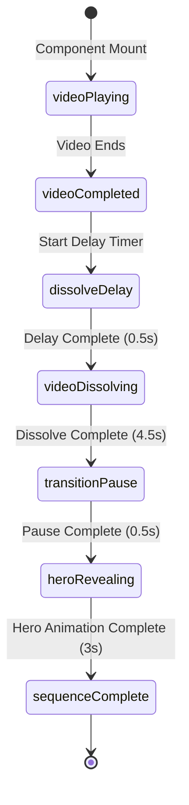
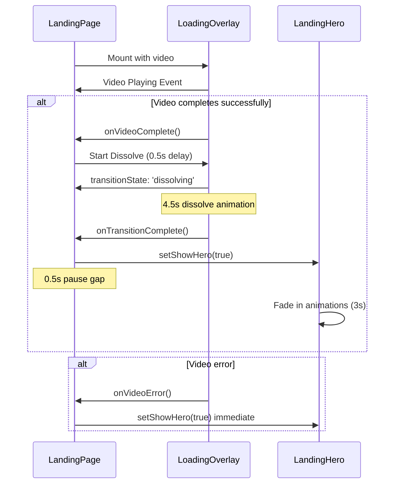

# Sequential Loading Animation Architecture Design

## Executive Summary

This document defines the architectural design for a sequential loading animation system that eliminates visual overlap and glitches in the landing page experience. The current implementation suffers from concurrent video dissolve and hero fade-in transitions, causing undesirable visual artifacts.

## Current Implementation Analysis

### Issues Identified

1. **Overlapping Transitions**: 
   - Video dissolve starts at video end + 0.5s delay (4.5s duration)
   - Hero fade-in starts at video end + 1s delay (3s duration) 
   - **Result**: Hero begins appearing while video is still dissolving (1s-4.5s overlap)

2. **Premature Visibility**:
   - Hero section becomes visible before video completely fades out
   - Creates "ghost" overlay effect where both video and hero are simultaneously visible

3. **Timing Conflicts**:
   - Video total time: End (0s) + Dissolve delay (0.5s) + Dissolve duration (4.5s) = 5s
   - Hero start time: End (0s) + Hero delay (1s) = 1s
   - **Overlap window**: 1s to 4.5s (3.5 seconds of visual conflict)

## Sequential Animation Design

### Timing Strategy

```mermaid
gantt
    title Sequential Loading Animation Timeline
    dateFormat X
    axisFormat %Ss
    
    section Video Phase
    Video Playback          :active, video, 0, 10s
    Video Complete Event   :milestone, video-end, 10s, 0s
    
    section Transition Phase  
    Dissolve Delay         :dissolve-delay, 10s, 0.5s
    Video Dissolve         :dissolve, 10.5s, 4.5s
    
    section Gap Phase
    Brief Pause           :pause, 15s, 0.5s
    
    section Hero Phase
    Hero Fade In          :hero, 15.5s, 3s
    Hero Animation        :hero-anim, 15.8s, 2.7s
```

### Animation Sequence Flow

1. **Video Playback** (0-10s):
   - Video plays from start to finish
   - Hero section remains completely hidden (`opacity: 0`)

2. **Video Dissolve Transition** (10.5-15s):
   - 0.5s delay after video ends
   - 4.5s smooth dissolve effect (blur, brightness, scale)
   - Hero section still hidden during this phase

3. **Brief Pause** (15-15.5s):
   - 0.5s gap between video complete fade and hero appearance
   - Ensures complete video cleanup and prevents overlap

4. **Hero Reveal** (15.5-18.5s):
   - Hero section fade-in begins
   - 3s duration with staggered animations
   - No concurrent video effects

## State Management Architecture

### Enhanced State Definitions

```typescript
// Enhanced video states
interface VideoState {
  // Existing states...
  playbackState: 'idle' | 'playing' | 'completed' | 'dissolving' | 'hidden';
  transitionState: 'idle' | 'dissolving' | 'complete' | 'hidden';
}

// New orchestration states
interface AnimationOrchestrationState {
  sequencePhase: 'video-playing' | 'video-dissolving' | 'transition-pause' | 'hero-revealing' | 'complete';
  canStartDissolve: boolean;
  canStartHero: boolean;
  dissolveStartTime: number;
  heroStartTime: number;
}

// Enhanced landing page state
interface LandingPageState {
  // Existing video and hero states...
  orchestrationState: AnimationOrchestrationState;
  shouldHideHero: boolean;
  shouldHideVideo: boolean;
  transitionTimers: {
    dissolveDelay?: NodeJS.Timeout;
    dissolveDuration?: NodeJS.Timeout;
    pauseDuration?: NodeJS.Timeout;
    heroDelay?: NodeJS.Timeout;
  };
}
```

### State Transition Logic



## Component Interaction Design

### Orchestration Flow



## Animation Specifications

### Video Dissolve Animation

```typescript
const videoDissolveVariants = {
  dissolving: {
    opacity: 0,
    filter: "blur(2px) brightness(1.2) contrast(1.1)",
    scale: 1.02,
    transition: {
      duration: 4.5,
      ease: [0.25, 0.46, 0.45, 0.94],
      delay: 0.5, // Pre-dissolve delay
      filter: {
        duration: 4.0,
        ease: "easeInOut"
      }
    }
  }
};
```

### Hero Reveal Animation

```typescript
const heroRevealVariants = {
  hidden: { 
    opacity: 0,
    y: 20 
  },
  visible: {
    opacity: 1,
    y: 0,
    transition: {
      duration: 3.0, // Extended duration for smooth reveal
      staggerChildren: 0.2,
      delayChildren: 0.3,
      ease: "easeOut"
    }
  }
};
```

### Transition Gap Animation

```css
/* Smooth gap transition */
.transition-gap {
  animation: fadeToBlack 0.5s ease-in-out forwards;
}

@keyframes fadeToBlack {
  0% { opacity: 0; }
  100% { opacity: 1; }
}
```

## Implementation Requirements

### Component Changes

#### 1. Landing Page (`src/components/landing-page.tsx`)

**New State Management:**
```typescript
const [orchestrationState, setOrchestrationState] = useState<AnimationOrchestrationState>({
  sequencePhase: 'video-playing',
  canStartDissolve: false,
  canStartHero: false,
  dissolveStartTime: 0,
  heroStartTime: 0
});

const [transitionTimers, setTransitionTimers] = useState<TransitionTimers>({});
```

**Enhanced Event Handlers:**
```typescript
const handleVideoComplete = useCallback(() => {
  setOrchestrationState(prev => ({
    ...prev,
    sequencePhase: 'video-completed'
  }));
  
  // Start dissolve sequence
  const dissolveDelayTimer = setTimeout(() => {
    setOrchestrationState(prev => ({
      ...prev,
      sequencePhase: 'video-dissolving',
      canStartDissolve: true
    }));
  }, 500); // 0.5s delay before dissolve
  
  setTransitionTimers(prev => ({ ...prev, dissolveDelayTimer }));
}, []);

const handleDissolveComplete = useCallback(() => {
  setOrchestrationState(prev => ({
    ...prev,
    sequencePhase: 'transition-pause'
  }));
  
  // Brief pause before hero
  const pauseTimer = setTimeout(() => {
    setOrchestrationState(prev => ({
      ...prev,
      sequencePhase: 'hero-revealing',
      canStartHero: true
    }));
    setShowHero(true);
  }, 500); // 0.5s pause gap
  
  setTransitionTimers(prev => ({ ...prev, pauseTimer }));
}, []);
```

**Conditional Rendering Logic:**
```typescript
const shouldShowVideo = !videoState.hasError && 
  orchestrationState.sequencePhase !== 'complete' &&
  orchestrationState.sequencePhase !== 'hero-revealing';

const shouldHideHero = orchestrationState.sequencePhase === 'video-playing' ||
  orchestrationState.sequencePhase === 'video-dissolving';
```

#### 2. Loading Overlay (`src/components/ui/loading-overlay/loading-overlay.tsx`)

**Enhanced Transition States:**
```typescript
type TransitionState = 'visible' | 'dissolving' | 'complete' | 'hidden';

interface VideoState {
  // ... existing properties
  playbackState: 'idle' | 'playing' | 'completed' | 'dissolving' | 'hidden';
}
```

**Modified Completion Logic:**
```typescript
const handleVideoEnded = useCallback(() => {
  setVideoState(prev => ({
    ...prev,
    isPlaying: false,
    playbackState: 'completed'
  }));
  
  // Don't trigger completion immediately - wait for orchestration
  // The parent component will handle the dissolve timing
}, []);
```

**Enhanced Dissolve Animation:**
```typescript
const overlayVariants = {
  visible: {
    opacity: 1,
    transition: { duration: 0.3 }
  },
  dissolving: {
    opacity: 0,
    filter: "blur(2px) brightness(1.2) contrast(1.1)",
    scale: 1.02,
    transition: {
      duration: 4.5,
      ease: [0.25, 0.46, 0.45, 0.94],
      delay: 0.5
    }
  },
  hidden: {
    opacity: 0,
    transition: { duration: 0 }
  }
};
```

#### 3. Landing Hero (`src/components/ui/landing-hero.tsx`)

**Enhanced Visibility Control:**
```typescript
interface LandingHeroProps {
  // ... existing props
  orchestrationPhase?: AnimationPhase;
  shouldForceHidden?: boolean;
}

const LandingHero: React.FC<LandingHeroProps> = ({
  orchestrationPhase,
  shouldForceHidden,
  // ... other props
}) => {
  const isHidden = shouldForceHidden || 
    orchestrationPhase === 'video-playing' ||
    orchestrationPhase === 'video-dissolving';
    
  const containerVariants = {
    hidden: { 
      opacity: 0,
      y: 20
    },
    visible: {
      opacity: 1,
      y: 0,
      transition: {
        duration: 3.0, // Extended for smooth reveal
        staggerChildren: 0.2,
        delayChildren: 0.3
      }
    }
  };
  
  return (
    <motion.div
      className={className}
      initial={isHidden ? "hidden" : "visible"}
      animate={isHidden ? "hidden" : "visible"}
      variants={containerVariants}
    >
      {/* ... existing content */}
    </motion.div>
  );
};
```

## Timing Configuration

### Global Timing Constants

```typescript
export const ANIMATION_TIMING = {
  VIDEO_DISSOLVE_DELAY: 500,    // 0.5s delay before dissolve starts
  VIDEO_DISSOLVE_DURATION: 4500, // 4.5s dissolve animation
  TRANSITION_PAUSE: 500,        // 0.5s gap before hero
  HERO_FADE_DURATION: 3000,     // 3s hero fade-in
  HERO_STAGGER_DELAY: 200,      // 0.2s stagger between elements
  HERO_CONTENT_DELAY: 300       // 0.3s delay before first element
} as const;
```

### Reduced Motion Adaptations

```typescript
const getAnimationConfig = (reducedMotion: boolean) => ({
  videoDissolveDuration: reducedMotion ? 0 : ANIMATION_TIMING.VIDEO_DISSOLVE_DURATION,
  heroFadeDuration: reducedMotion ? 0 : ANIMATION_TIMING.HERO_FADE_DURATION,
  transitionPause: reducedMotion ? 0 : ANIMATION_TIMING.TRANSITION_PAUSE,
  delays: {
    dissolveDelay: reducedMotion ? 0 : ANIMATION_TIMING.VIDEO_DISSOLVE_DELAY,
    heroDelay: reducedMotion ? 0 : ANIMATION_TIMING.HERO_CONTENT_DELAY
  }
});
```

## Error Handling & Edge Cases

### Video Load Failure
- **Current**: Hero appears immediately on video error
- **New**: Maintain sequential flow - wait for dissolve timeout, then show hero
- **Rationale**: Consistent user experience regardless of video status

### Premature Tab Switch/Visibility
```typescript
useEffect(() => {
  const handleVisibilityChange = () => {
    if (document.hidden && orchestrationState.sequencePhase === 'video-dissolving') {
      // Pause dissolve animation
      // Resume when visible again
    }
  };
  
  document.addEventListener('visibilitychange', handleVisibilityChange);
  return () => document.removeEventListener('visibilitychange', handleVisibilityChange);
}, [orchestrationState.sequencePhase]);
```

### Memory Management
```typescript
useEffect(() => {
  return () => {
    // Cleanup all transition timers
    Object.values(transitionTimers).forEach(timer => {
      if (timer) clearTimeout(timer);
    });
  };
}, []);
```

## Performance Considerations

### GPU Acceleration
```css
.video-container {
  transform: translateZ(0); /* Force GPU acceleration */
  will-change: opacity, filter, transform;
}

.hero-container {
  will-change: opacity, transform;
}
```

### Preloading Strategy
```typescript
// Preload hero assets during video playback
useEffect(() => {
  if (orchestrationState.sequencePhase === 'video-playing') {
    const heroImage = new Image();
    heroImage.src = HERO_LOGO_URL;
    
    // Preload critical fonts
    document.fonts.load('400 16px Orbitron');
  }
}, [orchestrationState.sequencePhase]);
```

## Testing Strategy

### Unit Tests Required
1. **State Transition Tests**: Verify correct sequence progression
2. **Timer Tests**: Ensure proper timing delays and cleanup
3. **Animation Tests**: Validate CSS/Framer Motion configurations
4. **Error Handling Tests**: Video load failure scenarios

### Integration Tests Required
1. **End-to-End Flow**: Video → Dissolve → Pause → Hero sequence
2. **Concurrent State**: Verify no overlapping transitions
3. **Reduced Motion**: Validate accessibility compliance
4. **Cross-Browser**: Test dissolve effects across browsers

### Performance Tests Required
1. **Memory Leaks**: Verify timer cleanup
2. **Frame Rate**: Ensure smooth 60fps during transitions
3. **Bundle Size**: Monitor impact of additional state management

## Implementation Checklist

### Phase 1: Foundation
- [ ] Implement enhanced state management in LandingPage
- [ ] Add transition timer cleanup logic
- [ ] Create timing constants configuration

### Phase 2: Video Component Updates
- [ ] Modify LoadingOverlay state transitions
- [ ] Update dissolve animation timing
- [ ] Add orchestration phase awareness

### Phase 3: Hero Component Updates
- [ ] Enhance visibility control logic
- [ ] Adjust animation durations for sequential flow
- [ ] Add orchestration phase props

### Phase 4: Integration & Testing
- [ ] Wire up complete orchestration flow
- [ ] Test all transition sequences
- [ ] Validate reduced motion handling
- [ ] Performance optimization

### Phase 5: Validation
- [ ] Cross-browser testing
- [ ] Accessibility validation
- [ ] Performance benchmarking
- [ ] User experience review

## Migration Strategy

### Backward Compatibility
- Maintain existing props interfaces
- Provide fallback for older animation configurations
- Ensure gradual feature adoption

### Feature Flags
```typescript
const useSequentialAnimation = process.env.REACT_APP_SEQUENTIAL_ANIMATION === 'true';
```

### Rollback Plan
- Feature toggle for instant rollback
- Preserve original animation logic as fallback
- Monitor performance metrics during rollout

## Success Metrics

### Visual Quality
- Zero overlapping transitions
- Smooth dissolve effects without artifacts
- Consistent timing across devices

### Performance
- Maintain 60fps during transitions
- No memory leaks from timer management
- Sub-second hero reveal start time

### User Experience
- Reduced perceived loading time
- No visual glitches or artifacts
- Accessible reduced motion support

---

*This architecture design provides a complete foundation for implementing the sequential loading animation system while maintaining performance, accessibility, and user experience quality.*